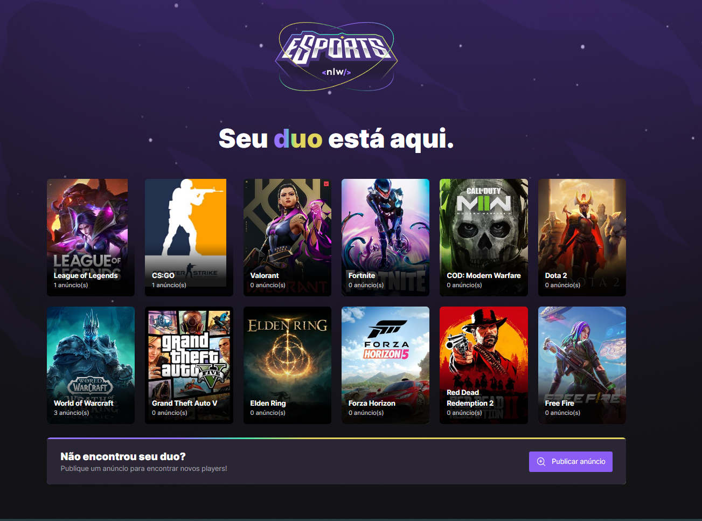
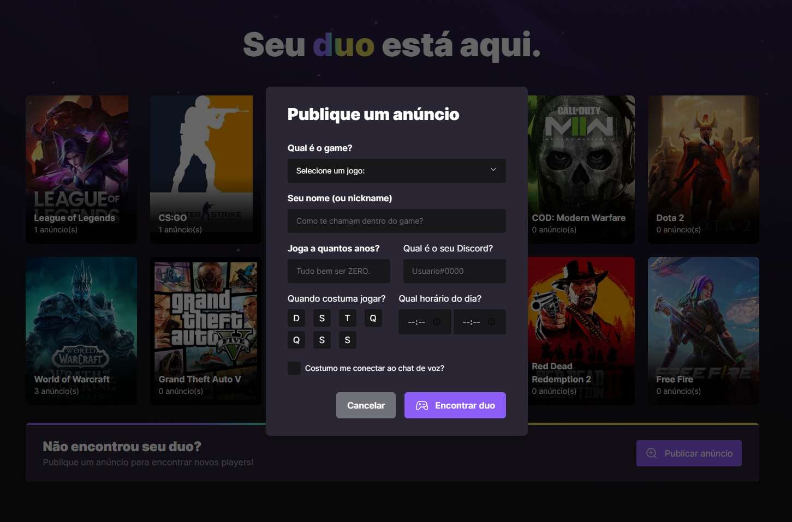
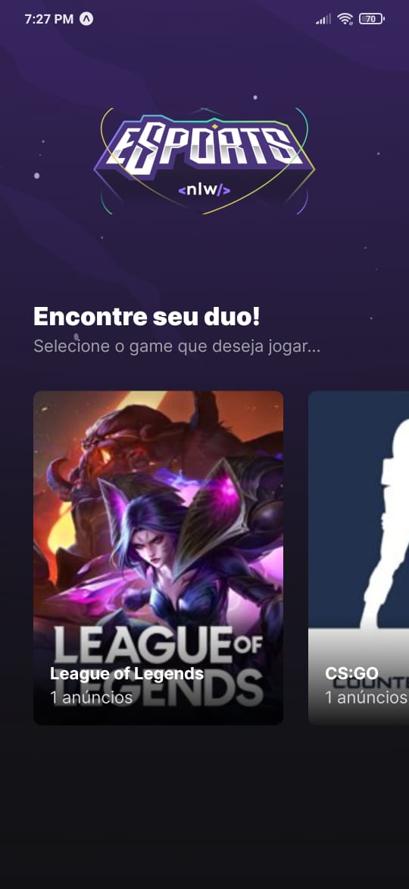
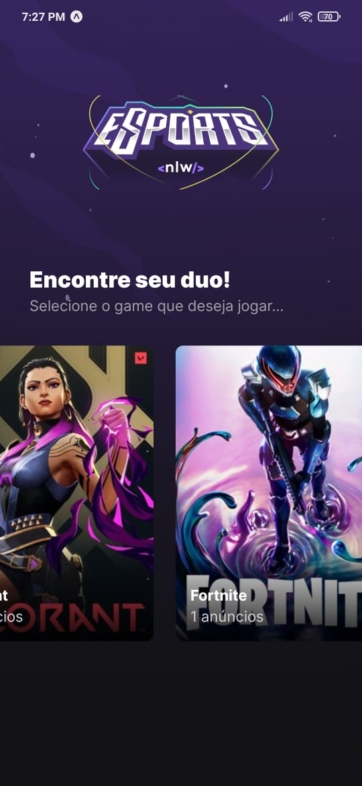
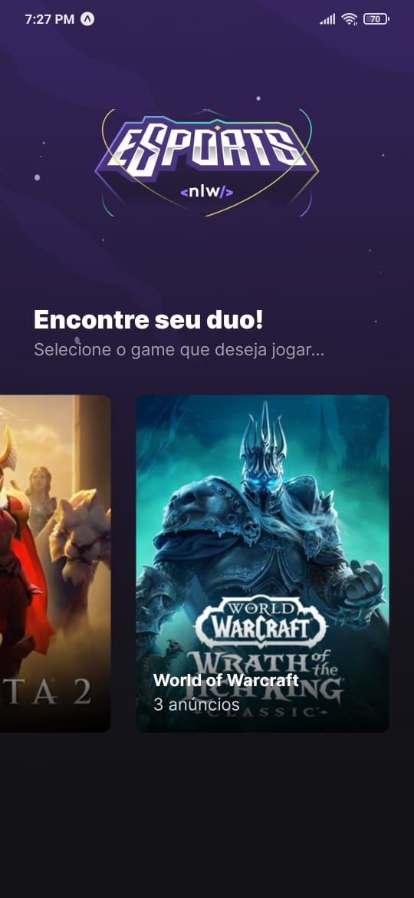
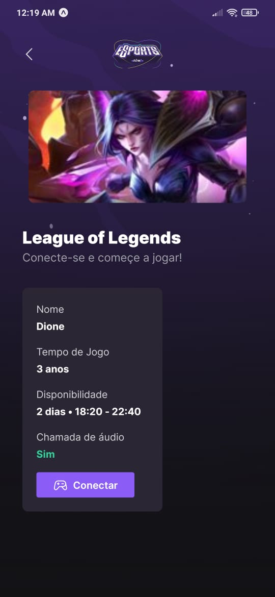
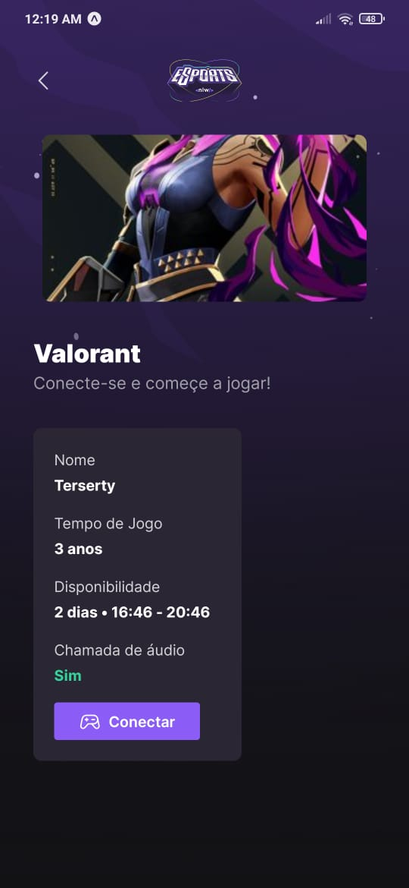
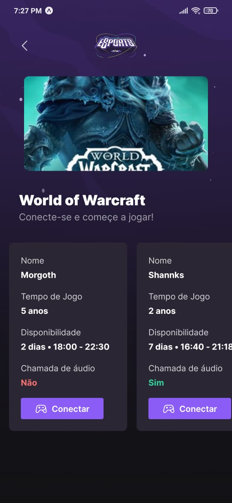
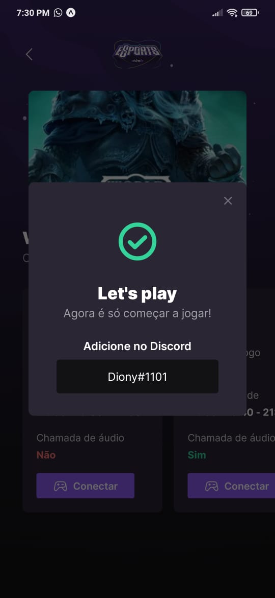
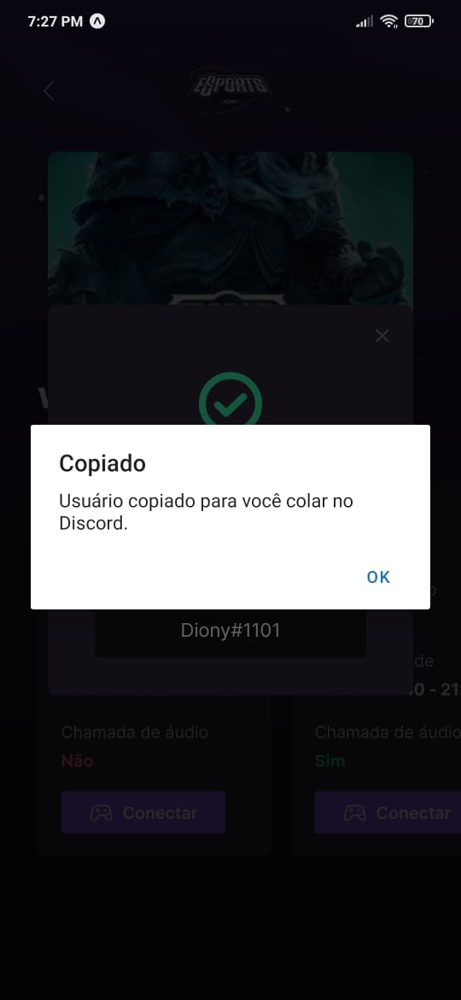

# NLW-eSports 

Aplicação Web e Mobile realizada por mim na New Level Weak-eSports, evento da Rocketseat. 

Você já ficou em filas esperando alguém para jogar aquela partida com a galera, mas ninguem aparece no dia, mas não fique triste, essa aplicação tem o intuito de conectar jogadores. Este APP vai deixar você dizer qual é o seu(s) jogo(s) favorito(s) e se planejar para entrar de vez no jogatina.

## :mag_right:Sobre o projeto
A inspiração para desenvolver e acompanhar o projeto veio do evento (New Level Week) - NLW eSports, proposto pela Rocketseat em Setembro de 2022. Com o desenvolvimento e orientações
foi possível aprender e aplicar diversas tecnologias, gerar uma interação com outros desenvolvedores nos canais do Discord e principalmente aprender muito sobre programação nas diferentes frentes (front, back e mobile).

## :art: Layout
### Web - HOME

### Web - Publicar Anúncio

### Mobile - Jogos Exemplos

                                                                                           
### Mobile - Anúncios por jogos exemplos
                                                                                           

                                                                                                 
### Mobile - Let's play e Copiar Discord
                                                          

                                                                                                
## :movie_camera: Funcionalidades (web e mobile)
https://user-images.githubusercontent.com/58345467/194452412-cea5b530-a48c-4f94-ba9a-e6ac0886debc.mp4

## :gear: Tecnologias/Ferramentas usadas
### Front end
- [HTML5](https://developer.mozilla.org/pt-BR/docs/Web/HTML)
- [CSS com TailwindC](https://tailwindcss.com/)
- [Vite](https://vitejs.dev/)
- [TypeScript](https://www.typescriptlang.org/)
- [React](https://pt-br.reactjs.org/)
### Back end
- [Node.js](https://nodejs.org/en/)
- [Prisma](https://www.prisma.io/)
### Mobile
- [React Native](https://reactnative.dev/)
- [Expo](https://expo.dev/)

## :file_folder: Como executar o projeto

Requisitos: 
- node instalado na máquina
- git instalado na máquina
 
### Criar uma pasta para o projeto
No terminal, no local onde deseja criar uma pasta execute o comando: 
mkdir <nome_da_pasta>
### Clonar repositório
git clone https://github.com/DioneDw/nlw-eSports.git
### Instalar o node modules e dependências em cada uma das 3 pastas principais (server, web e mobile)
npm install                                                                                          
### Criar o vinculo da database e o Prisma (ORM) novamente, na pasta server
npx prisma generate                                                                                                 

### Iniciar serviços server e web (dentro das pastas server, web. Executar):                                                                                  
npm run dev 
                                                                                                 
### Iniciar serviço mobile (dentro da pasta mobile. Executar):                                                                                              
expo start          

### Alterar IP de chamda mobile.
Nos arquivos index.tsx da pasta \mobile\src\screens\Game e \mobile\src\screens\Home alterar o endereço IP para o exibido após executar o comando expo start.
 
Exemplo de endereço mostrado no terminal:  Metro waiting on exp://192.168.2.4:19000
 
Exemplo de uma das alterações: fetch('http://192.168.2.4:3333/games')....
                                                                                                 
## :raising_hand_man: Autor
Dione Willy Evangelista
https://www.linkedin.com/in/dione-willy-evangelista-59ab8314a/

---
---
